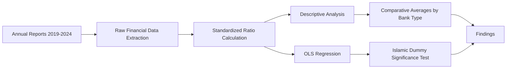

# no-cost-disadvantage

**Does Islamic banking actually cost more? Six banks, six years, and a regression say no.**

<p>
  
  
  
  
  
</p>

---

> **TL;DR**
> Pakistani literature from 2003–2014 says Islamic banks are less cost-efficient
> than conventional banks. This study re-tests that claim on a 2019–2024 sample
> and finds the opposite: operating costs are statistically identical between
> the two groups, and once profitability and financing structure are controlled
> for, being an "Islamic bank" has **zero independent effect** on what
> depositors are paid. The popular belief doesn't survive contact with the data.

---

## Contents

- [The Question](#the-question)
- [The Sample](#the-sample)
- [How It Works](#how-it-works)
- [Findings at a Glance](#findings-at-a-glance)
- [The Regression](#the-regression)
- [Repository Structure](#repository-structure)
- [Reproduce It Yourself](#reproduce-it-yourself)
- [Limitations](#limitations)
- [License](#license)

---

## The Question

<table>
<tr>
<td>

**The claim being tested:** Islamic banks in Pakistan carry higher structural
operating costs because of Shariah governance, dual-window compliance, and
documentation overhead and this cost gets passed on to depositors as lower
returns.

**Where that claim comes from:** Qureshi & Shaikh (2012), Khan & Shah (2015),
and Majeed & Zanib (2016), three Pakistan-specific studies, all using data
that ends in 2014.

**What's missing:** No study has re-tested this on the post-2019 data, and
none of them ask the downstream question, even if a cost gap exists, does it
actually reach the depositor, or does it get absorbed somewhere else in the
balance sheet?

</td>
</tr>
</table>

---

## The Sample

| | Islamic | Conventional |
|---|---|---|
| Bank 1 | Meezan Bank | Askari Bank |
| Bank 2 | BankIslami Pakistan | JS Bank |
| Bank 3 | Dubai Islamic Bank Pakistan | Habib Bank Limited (HBL) |

**Period:** FY2019 – FY2024
**Observations:** 36 bank-years
**Data source:** Publicly available, audited annual reports only. No
proprietary databases, no confidential disclosures — every number in this
repo can be independently re-checked against a public filing.

---

## How It Works



<details>
<summary><strong>Click to expand: full variable list</strong></summary>

**Dependent variable**
- Deposit Return — the return/profit paid to depositors

**Independent variables**
- Operating Expense Ratio
- Cost-to-Income Ratio
- Return on Assets (ROA)
- Return on Equity (ROE)
- Cash-to-Assets Ratio
- Financing-to-Assets Ratio
- Bank Size (log of total assets)
- Islamic Dummy (1 = Islamic bank, 0 = conventional)

</details>

---

## Findings at a Glance

| Ratio | Conventional | Islamic | Difference |
|---|---|---|---|
| Operating Expense Ratio | 2.42% | 2.41% | −0.11% (no difference) |
| Cost-to-Income Ratio | 61.98% | 45.35% | −26.83% |
| ROA | 0.68% | 1.34% | +96.40% |
| ROE | 12.43% | 21.97% | +76.84% |
| Cash-to-Assets Ratio | 7.11% | 7.11% | −0.14% (no difference) |
| Financing-to-Assets Ratio | 37.61% | 45.96% | +22.20% |

<details>
<summary><strong>Click to expand: what this actually means</strong></summary>

Islamic banks in this sample are not cheaper to run — the Operating Expense
Ratio is nearly identical across both groups. But they convert a similar cost
base into far more income (Cost-to-Income Ratio), and they deploy a larger
share of their balance sheet into financing rather than lower-yielding
investments. That combination, not lower costs or lower cash buffers, is what
drives the profitability gap.

</details>

---

## The Regression

```
Deposit Return = β0 + β1(Operating Expense Ratio) + β2(Cost-to-Income Ratio)
                + β3(ROA) + β4(Cash-to-Assets Ratio)
                + β5(Financing-to-Assets Ratio) + β6(Bank Size)
                + β7(Islamic Dummy) + ε
```

| Variable | Coefficient | p-value | Significant at 5% |
|---|---|---|---|
| ROA | 1,033,848,838 | 0.0364 | Yes |
| Financing-to-Assets Ratio | 67,428,100 | 0.0004 | Yes |
| Bank Size | 7,857,986 | 0.0033 | Yes |
| Operating Expense Ratio | 164,246,984 | 0.4557 | No |
| Cost-to-Income Ratio | 6,013,996 | 0.7223 | No |
| Cash-to-Assets Ratio | -16,459,738 | 0.8302 | No |
| **Islamic Dummy** | **1,160,228** | **0.7854** | **No** |

**Model fit:** R² = 0.689 · Adjusted R² = 0.611 · F = 8.856 · Significance F = 9.9996 × 10⁻⁶ · n = 36

> The Islamic Dummy is the whole point of this study, and it doesn't clear
> the bar. Once financing structure and profitability are already in the
> model, knowing whether a bank is "Islamic" or "conventional" tells you
> nothing further about what it pays depositors.

---

## Repository Structure

```
.
├── data/
│   └── raw-financials.xlsx        Hand-collected annual report data
├── analysis/
│   ├── ratio-workbook.xlsx        Descriptive stats, trend charts, comparative averages
│   └── regression.R               OLS regression script
├── report/
│   └── research-report.docx       Full report: literature review, methodology, findings
├── LICENSE
└── README.md
```

---

## Reproduce It Yourself

1. Open `analysis/ratio-workbook.xlsx` to inspect the raw data and computed
   ratios per bank-year.
2. Run `analysis/regression.R` in RStudio to reproduce the regression output
   above.
3. Read `report/research-report.docx` for the full literature review,
   methodology, and discussion of limitations.

---

## Limitations

<details>
<summary><strong>Click to expand</strong></summary>

- **Small sample.** Three banks per group is enough to compute a group
  average but not enough to generalize about the entire Islamic or
  conventional banking sector in Pakistan. One bank (Dubai Islamic Bank) is
  shown in the report to single-handedly move its group's average on the
  deposit-utilisation measure.
- **Single country, single regulator.** All findings are specific to
  State Bank of Pakistan-regulated banks and unconsolidated financial
  statements.
- **Correlation, not causation.** The regression identifies statistical
  relationships between operating costs and depositor returns — it cannot
  establish that one causes the other.
- **Undisclosed Shariah-governance costs.** Some Shariah-board and
  compliance-specific expense line items are not separately broken out in
  annual reports, so they could not be isolated as a distinct variable.

</details>

---

## License

MIT — see [LICENSE](LICENSE).

## Author

**Muhammad Tayyab Latif**
BS Accounting & Finance, National University of Sciences and Technology (NUST)
m.tayyablatif1@gmail.com
